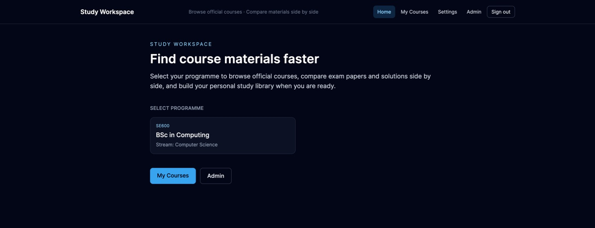
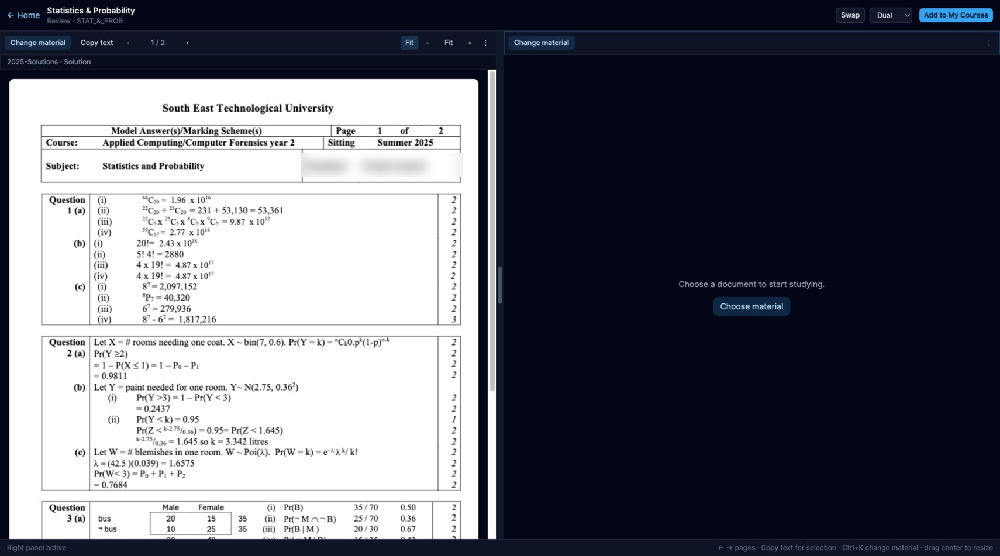

# Study Platform: AI exam-preparation assistant

> A personal project (in development) by **Roman Atamanchuk**, BSc (Hons) Computer Science student at SETU Waterford.

I study by day and work night shifts, so I have little time and energy to revise. I started building this platform in summer 2026 to make exam preparation faster. When it is finished, I plan to revise all my modules with it.



## The learning approach

The code matters less than the approach behind it:

- **Simple first.** Start with the easier material and build up.
- **Focus on what is asked most.** Prioritise the question types that appear most often in previous years' exams.
- **Explain in layers.** A short answer first; details only when you want them.
- **Think before you see the answer.** Hints come before full solutions, and your working can be compared with the official solution.
- **Show, don't just tell.** AI answers are drawn as charts, formulas, tables and step-by-step working instead of long text.
- **Learn from videos too.** Linking relevant YouTube tutorials is planned.

## Features

- **Dual-panel workspace.** An exam paper and its solution (or your notes) open side by side.

  

- **AI tutor.** Ask about the page you are reading. The request type (hint, solve, explain, extract, visualise) is detected, and the prompt is built from the exam page, the official solution and course materials.

  

- **Structured, visual AI answers.** The model returns JSON that the backend validates; the frontend renders it with real libraries: **Plotly** (charts, boxplots, histograms, regression, probability trees), **KaTeX** (formulas), **Mermaid** (diagrams) and styled tables. Answers are cached.
- **Personal course library.** Add official courses to *My Courses*, upload your own materials and notes, and keep a trash for deleted items.
- **Sharing.** Create a link so classmates can open a read-only copy of your workspace.
- **Accounts.** Register with a SETU email, sign in and reset your password (Spring Security, database-backed sessions).

## Tech stack

| Layer | Technologies |
|---|---|
| Frontend | React 19, TypeScript, Vite, Tailwind CSS, Zustand, React Router, PDF.js, Plotly, KaTeX, Mermaid |
| Backend | Java 21, Spring Boot 3.5 (Web, Data JPA, Security, Validation), Flyway, Apache PDFBox |
| AI | OpenAI-compatible chat API (OpenAI or DeepSeek models), JSON-structured responses |
| Data | PostgreSQL 16 |
| DevOps | Docker, Docker Compose (database, backend and frontend services) |

## Run it locally

1. Copy `.env.example` to `.env` and add your own `OPENAI_API_KEY` or `DEEPSEEK_API_KEY` (needed only for the AI tutor).
2. Start everything:

```bash
docker compose up --build
```

| Service  | URL                   |
|----------|-----------------------|
| Frontend | http://localhost:5173 |
| Backend  | http://localhost:8080 |

## Tests

```bash
cd backend && ./gradlew test
cd frontend && npm run build
```

## Status and next steps

The platform is in active development. Next: linking YouTube tutorials to topics, ranking questions by how often they appear in past exams, and revising my own modules with it.

*Exam papers shown in screenshots belong to their authors and are used only to demonstrate the interface; personal names are blurred.*
