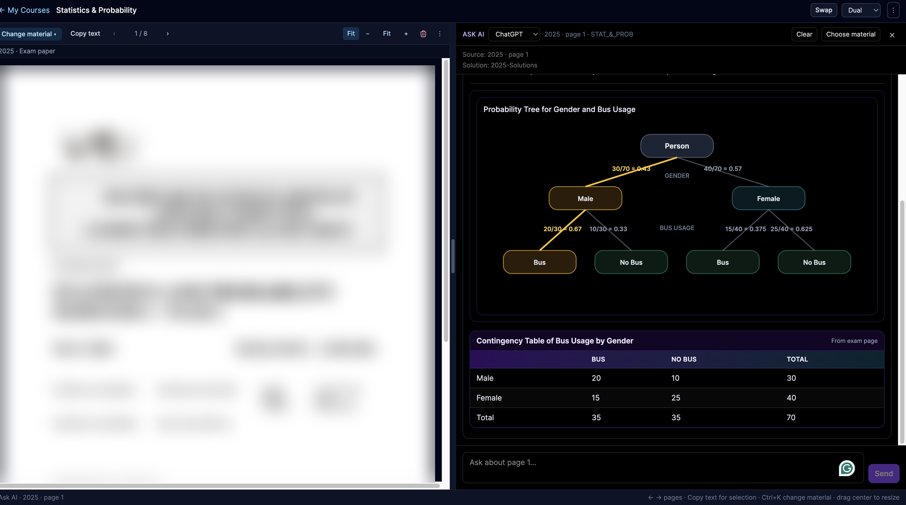

# Study Platform: AI exam-preparation assistant

## Features

- **Dual-panel workspace.** Open an exam paper and its solution (or your notes) side by side, with page navigation, zoom and swap.
- **AI tutor.** Ask about the page you are reading. The request type (hint, solve, explain, extract, visualise) is detected, and the prompt is built from the exam page, the official solution and course materials.

  

- **Structured, visual AI answers.** The model returns JSON that the backend validates; the frontend renders it with real libraries: **Plotly** (charts, boxplots, histograms, regression, probability trees), **KaTeX** (formulas), **Mermaid** (diagrams) and styled tables. Answers are cached.
- **Hints before answers.** A hint mode gives only the first step, and solutions can be compared with the official marking scheme.
- **Personal course library.** Add official courses to *My Courses*, upload your own materials, notes and videos, and keep a trash for deleted items.
- **Sharing.** Create a link so classmates can open a read-only copy of your workspace.
- **Accounts.** Register with a SETU email, sign in and reset your password (Spring Security, database-backed sessions).

## Planned

- Start with simpler material first and build up.
- Layered explanations: a short answer first, details on request.
- Rank questions by how often they appear in previous years' exams.
- Link YouTube tutorials to specific topics.

## Tech stack

| Layer | Technologies |
|---|---|
| Frontend | React 19, TypeScript, Vite, Tailwind CSS, Zustand, React Router, PDF.js, Plotly, KaTeX, Mermaid |
| Backend | Java 21, Spring Boot 3.5 (Web, Data JPA, Security, Validation), Flyway, Apache PDFBox |
| AI | OpenAI-compatible chat API (OpenAI or DeepSeek models), JSON-structured responses |
| Data | PostgreSQL 16 |
| DevOps | Docker, Docker Compose (database, backend and frontend services) |

## Run it locally

1. Copy `.env.example` to `.env` and add your own `OPENAI_API_KEY` or `DEEPSEEK_API_KEY` (needed only for the AI tutor).
2. Start everything:

```bash
docker compose up --build
```

| Service  | URL                   |
|----------|-----------------------|
| Frontend | http://localhost:5173 |
| Backend  | http://localhost:8080 |

## Tests

```bash
cd backend && ./gradlew test
cd frontend && npm run build
```

*Course documents in the screenshot are blurred; they belong to their authors.*
